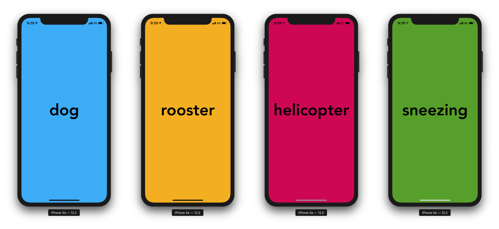

# A Simple Sound Classifier
> Sound Classifier Using Turicreate and CoreML

[](https://colab.research.google.com/drive/1hKPoEPVP8jGcfC5_mKk9cTWI-Mxvy4zV)

We'll create an iOS application that recognize sounds that are listed in the ESC-50 dataset.

### Final result


### Final result - Video with sound
[Video with sound - Vimeo](https://vimeo.com/355820387)

## Data preparation

I'm using the ESC-50 dataset.

[ESC-50: Dataset for Environmental Sound Classification](https://github.com/karoldvl/ESC-50)

I've tested the model on only four classes, even if it's capable of recognizing way more:

* dog
* rooster
* helicopter
* sneezing

In the python script I've only used the ESC-10 dataset which is way smaller than the ESC-50 one. You can change the script to not exclude the 


## Train the model

MacOS, Linux & Windows:

Set your python environment and run the following script:

```sh
./python > main.py
```

This model is tested on `turicreate v5.7`

##Colab Notebook

https://colab.research.google.com/drive/1hKPoEPVP8jGcfC5_mKk9cTWI-Mxvy4zV

## About me

**Omar MHAIMDAT** 

* [Linkedin](https://www.linkedin.com/in/omarmhaimdat/)
* **Email:** omarmhaimdat@gmail.com
* [Look at the rest of my repos](https://github.com/omarmhaimdat/)

Distributed under the MIT license. See ``LICENSE`` for more information.

